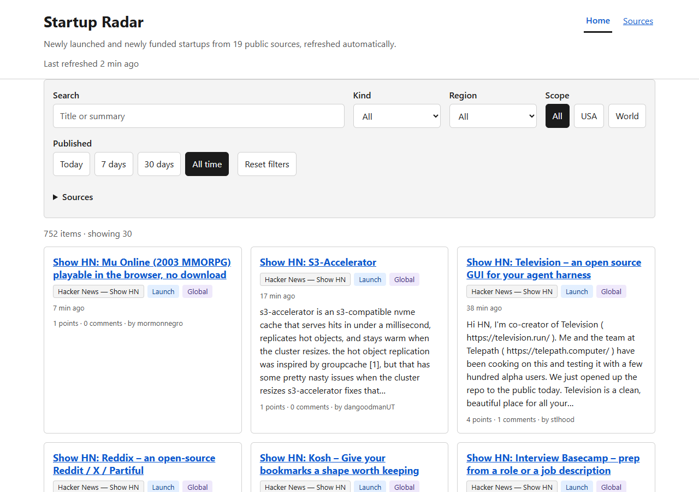
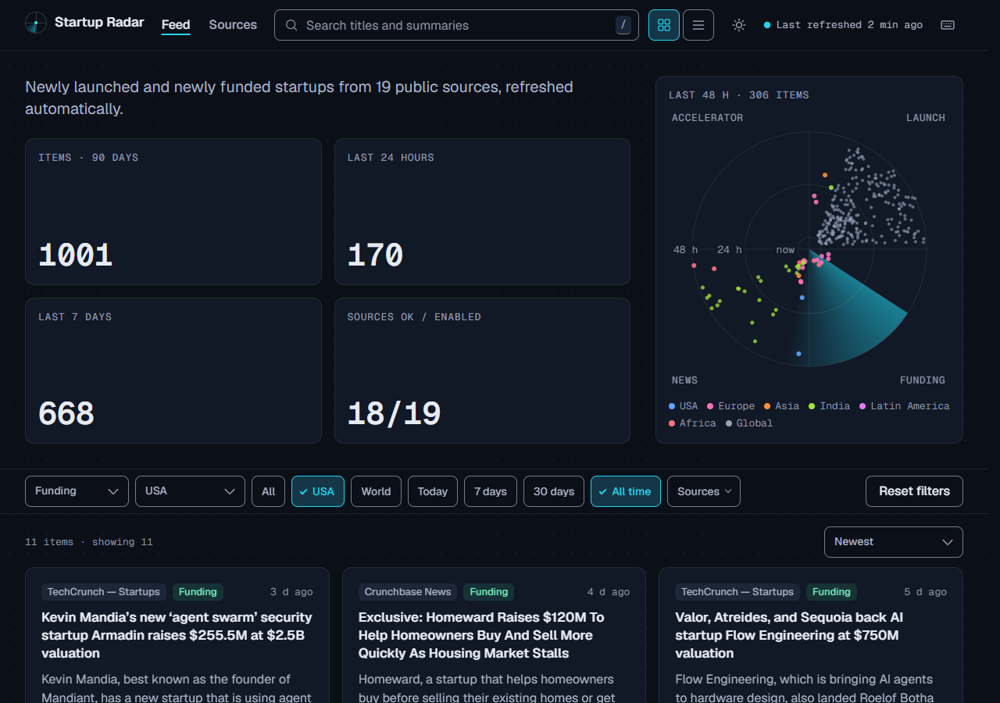
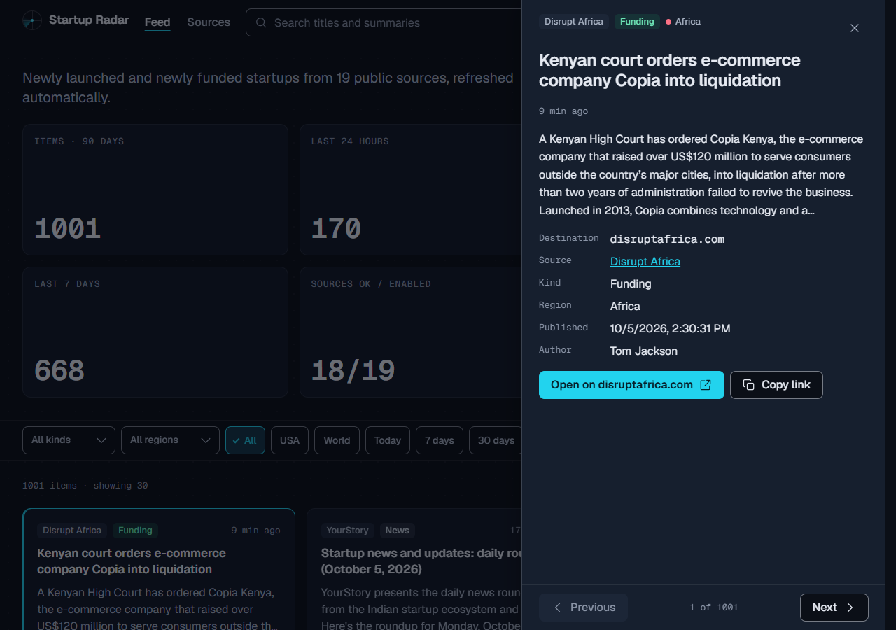
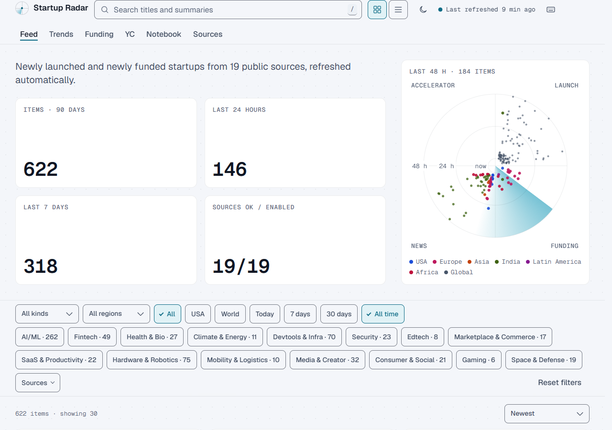
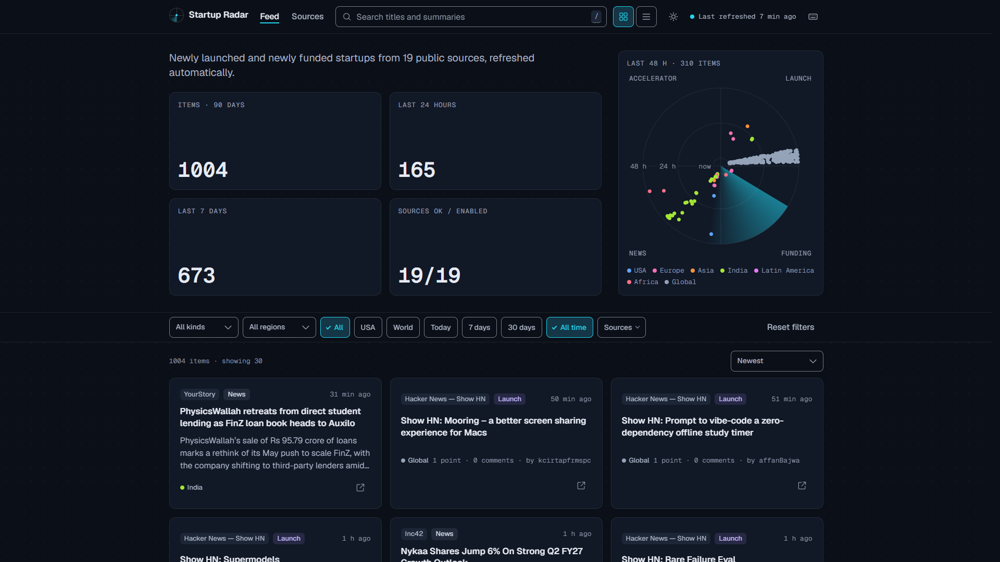
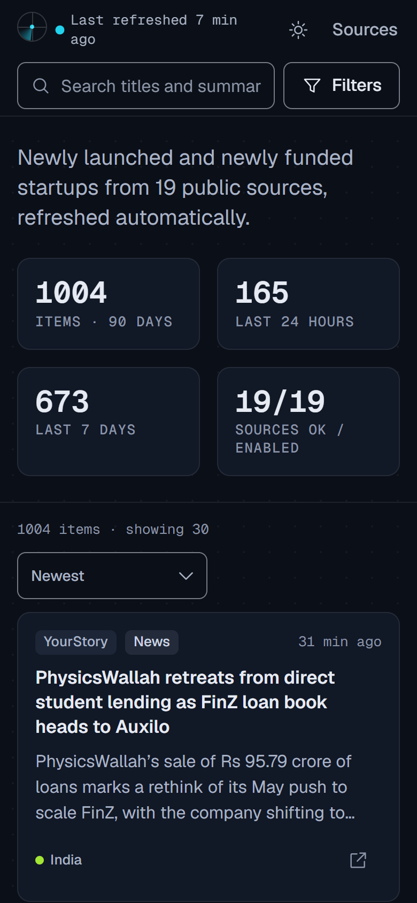
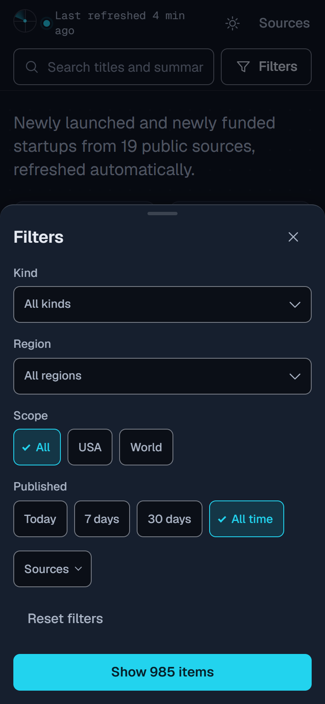
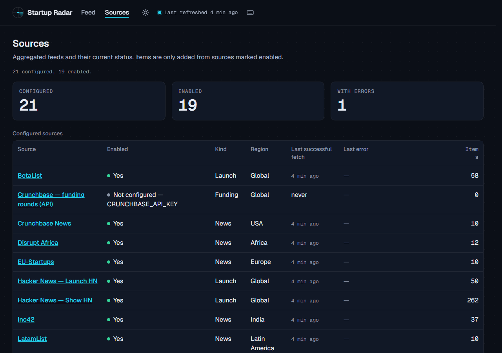

# Startup Radar

A small aggregator for discovering new startups: product launches, funding news and
accelerator batches, pulled from public feeds and APIs into one searchable, filterable page.

Live site: **https://sudish007.github.io/startup-radar** — a static build hosted for free on
GitHub Pages and rebuilt every hour by GitHub Actions (see
[Hosting on GitHub Pages](#8-hosting-on-github-pages-free)). The same code also runs as a
single Node.js process with a SQLite database that refreshes itself on a timer, which is the
[Railway](https://railway.com) deployment described further down for anyone who wants a live
server and the JSON API.

It only aggregates sources that publish a public feed or API. Paid databases (Crunchbase,
PitchBook, Dealroom and others) are listed as links; nothing is scraped from them. Vote counts,
points and funding amounts are shown only when the source provides them; the app never invents
metrics.

## Contents

1. [What it is](#1-what-it-is) · [The web UI](#the-web-ui)
2. [Sources](#2-sources)
3. [Requirements](#3-requirements)
4. [Quick start](#4-quick-start)
5. [Configuration](#5-configuration)
6. [API and data files](#6-api-and-data-files)
7. [How refresh works](#7-how-refresh-works)
8. [Hosting on GitHub Pages (free)](#8-hosting-on-github-pages-free)
9. [Deploy to Railway (live server)](#9-deploy-to-railway-live-server)
10. [Railway limits and cost](#10-railway-limits-and-cost)
11. [Screenshots](#11-screenshots)
12. [Adding a source](#12-adding-a-source)
13. [Tests](#13-tests)
14. [Security notes](#14-security-notes)
15. [License](#15-license)

## 1. What it is

Startup Radar fetches 19 public sources, normalizes each entry to one row (title, URL, summary,
source, kind, region, published date), de-duplicates by URL and stores everything in SQLite.
On the static site this happens once per hourly build; on a server it happens every
`REFRESH_MINUTES` (default 30).

The web UI (`index.html`) loads the item list once from `data/items.json` and does all
filtering, sorting, searching and paging in the browser: filter by kind (launch, funding,
news, accelerator), region (USA, Europe, Asia, India, Latin America, Africa, global, or an
All / USA / World toggle), source and time window, and search titles and summaries (all terms
must match as whole words or word prefixes). Filter state is kept in the URL so views can be
shared. `sources.html` shows every adapter with its last fetch status, last error and item
count, followed by an "Explore more" list of directories that are links only. The same UI
works unchanged on GitHub Pages and on the Node server; the server additionally exposes a
read-only JSON API.

### The web UI

The frontend is plain HTML, CSS and ES modules under `public/` with no framework, no build
step and no third-party script. What it does:

- **Dark-first theme.** `theme.js` (a classic script under 1 KB in `<head>`) applies the stored
  choice (`localStorage['sr:theme']`) or the OS preference before the first paint, so there is
  no flash. The sun/moon button in the top bar and the `t` key switch themes; the choice is
  remembered. Both themes meet WCAG AA contrast on every surface, including the translucent
  glass top bar, which is measured against the most extreme colour that can scroll under it.
- **Sticky top bar with search, a sticky filter bar at 1024 px and wider, a bottom-sheet filter
  panel below 640 px** (`Filters` button with an active-filter count). The result list is one,
  two or three columns and has a grid / list toggle (remembered as `sr:view`).
- **Mission-control hero**: four stat tiles (items in the 90-day feed, last 24 hours, last
  7 days, sources OK / enabled) counted from the real data files, and a radar panel at 1024 px
  and wider on devices with a mouse or trackpad, with one blip per item published in the last
  48 h: kind by quadrant, region by angle, age by distance from the centre. The caption counts
  the blips before the 400 cap. Hovering a blip shows the item, clicking opens it. The feed list
  is the keyboard and touch equivalent; the radar adds nothing you cannot reach there.
- **In-app detail drawer.** Clicking a card (or pressing `Enter` on a highlighted one) opens
  the item in a side drawer with every field the source actually provided (points, comments,
  votes, batch, round, amount, website...), a prev/next pair that walks the current result list,
  a "Copy link" button and an "Open on <source>" link. Each card also has a small
  external-link icon for going straight to the source. The drawer writes `?item=<key>` to the
  URL, so a drawer link can be shared and the Back button closes it. The key is a hash of the
  item URL, stable across builds (`itemKey` in `public/filter.js`).
- **Keyboard layer** (press `?` for the in-app list):

  | Key | Action |
  | --- | --- |
  | `/` | Focus the search field |
  | `j` / `↓`, `k` / `↑` | Next / previous card (`j` at the last card loads more) |
  | `Home` / `End` | First / last card |
  | `Enter` | Open the highlighted card in the detail drawer |
  | `o` | Open the original page in a new tab |
  | `Esc` | Close the top layer (help, drawer, filter sheet, sources list) or clear the highlight |
  | `t` | Toggle dark / light theme |
  | `?` | Keyboard shortcuts |
  | `j` / `→`, `k` / `←` | In the drawer: next / previous item |

  Shortcuts are ignored while typing in a field; `Esc` always closes exactly one layer.
- **Live data.** `data/stats.json` is polled every 5 minutes (paused while the tab is hidden).
  When the build behind the page changed, the new items are fetched and a "N new items ·
  Refresh" pill appears; the list never reorders under your cursor. "Last refreshed ... ago"
  in the top bar ticks every minute. A failing check is shown as "update check failed" and the
  data you already have stays on screen.
- **Honest sort.** "Newest" (default) and "Most points / votes", which only orders items whose
  source provides Hacker News points or Product Hunt votes; everything else keeps its date
  order below them and the result count says so. There is no trending, score or ranking the
  data does not contain.
- **Installable, works offline.** `manifest.webmanifest` plus a hand-written service worker
  (`public/sw.js`, no library) precache the app shell under a relative scope, so it works on
  GitHub Pages sub-paths and on the Node server alike. Data files are network-first with the
  last good copy as fallback (the page then shows "Offline — showing data cached ... ago").
  Each build gets its own cache name; when a new build is deployed the open page shows an
  "Update available — Reload" toast and only reloads when you ask it to. The footer shows an
  "Install app" button when the browser offers it. Nothing is registered on plain `http://`
  other than `localhost`.
- **Fonts and icons.** Geist and Geist Mono (variable, OFL-1.1) are self-hosted from
  `public/fonts/`; `npm run fonts:copy` refreshes them from the pinned
  `@fontsource-variable/*` dev dependencies and fails if a byte size differs. The icon sprite
  is `public/icons.svg`; `npm run icons:make` renders the PWA icons under `public/icons/` with
  the repo's Playwright venv (`PW_CHANNEL` picks the browser, default `msedge`).
- **Budget.** The home page ships under 120 KB of HTML + CSS + JS uncompressed (the service
  worker and its client are loaded after `load` and have their own 10 KB budget); the
  numbers are enforced by `test/budget.test.js`. Reduced motion is honoured (the sweeps pause,
  loops stop, transitions become instant). To measure a build with Lighthouse 13 (which has no
  `--chrome-path` flag) point it at a local browser and a running host:

  ```powershell
  $env:CHROME_PATH = 'C:\Program Files (x86)\Microsoft\Edge\Application\msedge.exe'
  npx --yes lighthouse@13.5.0 http://localhost:3000/ --preset=desktop --only-categories=performance,accessibility,best-practices --chrome-flags="--headless=new" --output=json --output-path=lh-home.json --quiet
  Remove-Item Env:CHROME_PATH
  ```

## 2. Sources

Every source below was probed live on 2026-10-02 from a home network. "Aggregated by default"
sources need no credentials. "Optional" sources are implemented but off unless you set an
environment variable. "Links only" sources are shown on `sources.html` as links and are never
fetched, each with the reason. Some sources behave differently when fetched from GitHub's
shared runner IPs; see the note in [Hosting on GitHub Pages](#8-hosting-on-github-pages-free).

### Aggregated by default (19)

| Source | Kind | Region | Feed type | Link |
|---|---|---|---|---|
| Hacker News — Show HN | launch | global | JSON API (Algolia `search_by_date`, `tags=show_hn`) | [news.ycombinator.com/show](https://news.ycombinator.com/show) |
| Hacker News — Launch HN | launch | global | JSON API (Algolia, query `"Launch HN"`) | [news.ycombinator.com](https://news.ycombinator.com/) |
| Product Hunt | launch | global | Atom feed (`/feed`; GraphQL API when `PRODUCTHUNT_TOKEN` is set) | [producthunt.com](https://www.producthunt.com/) |
| Y Combinator — newest batches | accelerator | usa | JSON (`yc-oss.github.io/api` meta + the two newest batch files) | [ycombinator.com/companies](https://www.ycombinator.com/companies) |
| BetaList | launch | global | Atom feed (official FeedBurner feed; the on-site `/feed` URLs are 404) | [betalist.com](https://betalist.com/) |
| Launching Next | launch | global | RSS feed | [launchingnext.com](https://www.launchingnext.com/) |
| TechCrunch — Startups | news | usa | RSS feed | [techcrunch.com/category/startups](https://techcrunch.com/category/startups/) |
| TechCrunch — Venture | news | usa | RSS feed | [techcrunch.com/category/venture](https://techcrunch.com/category/venture/) |
| Crunchbase News | news | usa | RSS feed (the news site, not the Crunchbase database) | [news.crunchbase.com](https://news.crunchbase.com/) |
| Sifted | news | europe | RSS feed | [sifted.eu](https://sifted.eu/) |
| Tech.eu | news | europe | RSS feed | [tech.eu](https://tech.eu/) |
| EU-Startups | news | europe | RSS feed (official FeedBurner mirror; the site's own feed is behind a Cloudflare challenge) | [eu-startups.com](https://www.eu-startups.com/) |
| Inc42 | news | india | RSS feed | [inc42.com](https://inc42.com/) |
| YourStory | news | india | RSS feed (`/feed`; `/rss` is blocked) | [yourstory.com](https://yourstory.com/) |
| TechCabal | news | africa | RSS feed | [techcabal.com](https://techcabal.com/) |
| Disrupt Africa | news | africa | RSS feed | [disruptafrica.com](https://disruptafrica.com/) |
| LatamList | news | latam | RSS feed | [latamlist.com](https://latamlist.com/) |
| Tech Collective (SE Asia) | news | asia | RSS feed | [techcollectivesea.com](https://www.techcollectivesea.com/) |
| Vulcan Post | news | asia | RSS feed (occasionally slow; the 15 s timeout isolates it) | [vulcanpost.com](https://vulcanpost.com/) |

Items from news sources are re-labelled `funding` when the title or summary reads like a funding
announcement (see [How refresh works](#7-how-refresh-works)). Product Hunt items have no vote
counts unless `PRODUCTHUNT_TOKEN` is configured, because the public feed does not include them.

### Optional (off unless configured)

| Source | Enable with | Notes |
|---|---|---|
| Reddit — r/SideProject + r/startups | `ENABLE_REDDIT=true` | Uses the Atom endpoints (`new.rss`); Reddit's JSON endpoints returned 403 and `r/startups` returned 429 on every probe, so shared cloud IPs are likely to be rate-limited. One subreddit failing does not fail the source. |
| Product Hunt (GraphQL API) | `PRODUCTHUNT_TOKEN` | Replaces the Atom feed with the v2 GraphQL API and adds vote counts. A failing token is reported as an error on `sources.html` rather than silently falling back to the feed. |
| Crunchbase — funding rounds (API) | `CRUNCHBASE_API_KEY` | Crunchbase v4 `searches/funding_rounds`. Shown as "not configured" on `sources.html` without a key. The response mapping follows the v4 docs and has not been verified against a live key. |

### Links only (not aggregated)

| Site | Why it is a link |
|---|---|
| [Crunchbase](https://www.crunchbase.com/discover/organization.companies) | Paid database; the API adapter above needs `CRUNCHBASE_API_KEY` |
| [PitchBook](https://pitchbook.com/) | Paid private-market database |
| [CB Insights](https://www.cbinsights.com/) | Paid market-intelligence platform |
| [Dealroom](https://dealroom.co/) | Paid startup and VC database |
| [Tracxn](https://tracxn.com/) | Paid private-company intelligence |
| [Harmonic](https://harmonic.ai/) | Paid startup-discovery data for investors |
| [Seedtable](https://www.seedtable.com/) | Curated rankings; no public feed |
| [Wellfound](https://wellfound.com/startups) | Startup profiles and jobs; no public feed |
| [Indie Hackers](https://www.indiehackers.com/products) | No public feed (`/feed.xml`, `/rss` are 404) |
| [Tech in Asia](https://www.techinasia.com/) | Feed blocks automated clients (403) |
| [e27](https://e27.co/) | Feed behind Cloudflare (403) |
| [Uneed](https://www.uneed.best/) | Unreachable during verification (connect timeout) |
| [Tiny Startups](https://www.tinystartups.com/) | No feed |
| [StartupBase](https://startupbase.io/) | Only a blog feed exists, not the launch listings |

## 3. Requirements

- Node.js 22 or newer. `better-sqlite3` 13 (the SQLite binding) requires Node 22+, and it ships
  prebuilt binaries for Linux, macOS and Windows, so no compiler or Python is needed for
  `npm install`. `engines.node` in `package.json` is `>=22`; Railway reads it and builds with
  Node 22; the GitHub Actions workflow uses Node 24.
- Outbound HTTPS access to the sources above.
- Nothing else: SQLite is embedded and the frontend is static files. Hosting the static build
  needs no server at all (GitHub Pages serves `dist/`).

## 4. Quick start

```bash
npm install
cp .env.example .env        # PowerShell: Copy-Item .env.example .env
npm start                   # http://localhost:3000, first refresh starts right after listen
```

Other commands:

```bash
npm run fetch:once          # run one refresh cycle, print a per-source table, exit
npm run build:static        # fetch all sources once and write the static site to dist/ (what GitHub Pages serves)
npm run verify:pages -- <baseUrl>   # HTTP-level checks of a deployed site, e.g. https://sudish007.github.io/startup-radar
npm run dev                 # same as start, restarts on file changes (node --watch)
npm test                    # unit + API tests (node --test), no network needed
npm run fonts:copy          # refresh public/fonts/ from the pinned @fontsource-variable packages
npm run icons:make          # re-render public/icons/*.png from icons/radar.svg (Playwright venv, PW_CHANNEL=msedge)
```

`npm start` creates the database on first start in `DATA_DIR` (default
`./data/startup-radar.db`); the directory is created if it does not exist. The first refresh
cycle usually finishes within a few seconds; the page shows "Last refreshed never" until then.

`npm run build:static` needs network access and takes a few seconds to half a minute. It uses a
temporary database (never `./data`), prints the same per-source table as `fetch:once` plus an
`imported / fetched / exported` summary, and writes `dist/` (a copy of `public/`, `.nojekyll`
and `data/*.json`). `dist/` is gitignored. To preview it locally serve the folder with any static
file server, for example `python -m http.server 8080 --directory dist`.

`scripts/screenshots.py` (Python + Playwright) has two modes: the default parity mode compares
the UI with `/api/items` against a running Node server and rewrites the screenshots; with
`SMOKE_ONLY=1` it runs browser checks that need only the static files, so it also works against
a `dist/` preview or the live Pages site. See [Tests](#13-tests).

## 5. Configuration

All settings come from environment variables. A `.env` file in the working directory is loaded
at startup if present (Node's built-in loader, no `dotenv`); explicit environment variables win.
Copy `.env.example` to get started.

| Variable | Default | Used by | Notes |
|---|---|---|---|
| `PORT` | `3000` | server | Railway injects it; the server binds `process.env.PORT` on `0.0.0.0`. |
| `DATA_DIR` | `./data` | db | SQLite directory, created if missing; DB file `startup-radar.db`. On Railway set `/data` (the volume mount path). |
| `REFRESH_MINUTES` | `30` | refresh | Integer, clamped to 5..1440. |
| `ADMIN_TOKEN` | unset | app | Enables `POST /api/refresh` (Bearer token). Unset → the route answers 404. Generate one with `node -e "console.log(require('crypto').randomBytes(24).toString('hex'))"`. |
| `PRODUCTHUNT_TOKEN` | unset | producthunt | Developer Token from producthunt.com/v2/oauth/applications → create app → "Developer Token". Switches Product Hunt to the GraphQL API (adds votes). |
| `CRUNCHBASE_API_KEY` | unset | crunchbase | Enables the Crunchbase v4 funding-rounds adapter. |
| `ENABLE_REDDIT` | `false` | reddit | `true` enables r/SideProject + r/startups (Atom). Off by default because Reddit answered 403/429 during verification. |
| `PUBLIC_URL` | `http://localhost:3000` | config | Used in the outbound `User-Agent: StartupRadar/1.0 (+<PUBLIC_URL>)`. Set it to your Pages or Railway URL. |
| `PREVIOUS_SNAPSHOT_URL` | unset | build:static only | URL of the previously published `data/items.json`. Its items (plus the sibling `archive.json` and `sources.json`) are imported before the live fetch so history survives between static builds. A 404 (first build) or a network error is logged and tolerated. Ignored by `npm start`. |

`PORT`, `DATA_DIR`, `REFRESH_MINUTES` and `ADMIN_TOKEN` apply only to the Node server; the
static build has no port, no persistent database and no write endpoint. `PRODUCTHUNT_TOKEN`,
`CRUNCHBASE_API_KEY`, `ENABLE_REDDIT` and `PUBLIC_URL` apply to both.

Fixed constants (not configurable): 15 s timeout per source, 5 MB maximum response body,
API `limit` default 30 / maximum 100, summaries truncated to 300 characters. Static export caps:
items from the last 90 days, at most 3 000 items, `items.json` split at 800 items when the
whole set exceeds 600 KB (the rest goes to `archive.json`).

## 6. API and data files

### Data files (GitHub Pages and the Node server)

The frontend reads only these four files, with relative URLs, so it works under any base path
(the live site lives under `/startup-radar/`). On GitHub Pages they are static files written by
`npm run build:static`; the Node server generates the same shapes on request at the same paths
(`Cache-Control: no-store`). All filtering, searching and paging happens in the browser
(`public/filter.js`), so there are no query parameters.

| File | Content |
|---|---|
| `GET /data/items.json` | Array of items (same object shape as `/api/items` below, including `source.name`), newest first, from the last 90 days, at most 3 000. When the full set is larger than 600 KB this file holds the newest 800 and the rest moves to `archive.json`. |
| `GET /data/archive.json` | Older items (same shape) when the split happened; otherwise the file does not exist (404). The UI fetches it on demand: when "Load more" runs out of recent items, when the 30-days or All-time chip is selected, or when a search is typed. |
| `GET /data/sources.json` | Exactly the `/api/sources` payload: `{ "sources": [...], "exploreMore": [...] }`. Backs `sources.html`. |
| `GET /data/stats.json` | The `/api/stats` payload plus `generatedAt` (ISO 8601, when the build or request started) and `archiveItems` (number of items in `archive.json`, `0` when there is none). The UI shows "Last refreshed" from `lastRefresh`, falling back to `generatedAt`. |

`sources.html` is the sources page on both hosts; the Node server keeps `/sources` as an alias
for old links.

### JSON API (Node server only)

All endpoints return JSON. `GET` endpoints need no authentication and are read-only.
`/api/*`, `/data/*` and `/health` responses carry `Cache-Control: no-store`. Errors are
`{ "error": "<message>" }` without stack traces. None of the `/api/*` routes or `/health`
exist on GitHub Pages; the static site has only the data files above.

### `GET /health`

Returns `200 {"ok": true, "items": <int>, "lastRefresh": "<ISO 8601>" | null}` immediately, even
while a refresh is running. Railway uses this path as the deployment health check.

### `GET /api/items`

Query parameters (all optional):

| Param | Rule |
|---|---|
| `kind` | one of `launch`, `funding`, `news`, `accelerator`; anything else → 400 |
| `region` | one of `usa`, `europe`, `asia`, `india`, `latam`, `africa`, `global`, or `world` (= everything except `usa`); anything else → 400 |
| `source` | comma-separated adapter ids (e.g. `hn_show,techcrunch`); an unknown id → 400 |
| `q` | search text, max 200 characters, up to 8 terms; all terms must match as whole words or word prefixes in the title or summary (SQLite FTS5 `"term"*` prefix match, case- and accent-insensitive; a `LIKE` substring fallback is used only if FTS5 is unavailable, which is logged once at startup) |
| `since` | ISO 8601 date; only items published at or after it; unparsable → 400 |
| `page` | integer ≥ 1, default 1, max 10000 |
| `limit` | integer 1..100, default 30; out-of-range values are clamped and echoed back |

Response:

```json
{
  "items": [
    {
      "id": 1,
      "title": "…",
      "url": "https://…",
      "source": { "id": "techcrunch", "name": "TechCrunch — Startups" },
      "kind": "funding",
      "region": "usa",
      "summary": "…",
      "publishedAt": "2026-10-02T14:03:00.000Z",
      "fetchedAt": "2026-10-02T14:30:01.123Z",
      "extra": { "author": "…" }
    }
  ],
  "page": 1,
  "limit": 30,
  "total": 752,
  "hasMore": true
}
```

Items are ordered by `publishedAt` descending. `extra` holds whatever the source provided and
nothing else: `points`/`comments`/`author`/`hnUrl` (Hacker News), `batch` (Launch HN, YC),
`votes`/`website` (Product Hunt API), `batch`/`website`/`location`/`industry`/`teamSize`/`status`
(YC), `moneyRaisedUsd`/`currency`/`investmentType`/`organization` (Crunchbase API).

### `GET /api/sources`

`{ "sources": [...], "exploreMore": [...] }`. Each source has `id`, `name`, `homepage`, `kind`,
`region`, `enabled`, `requires` (the variable needed when disabled, else `null`), `lastRunAt`,
`lastSuccessAt`, `lastError`, `lastDurationMs`, `lastItemCount` and `itemCount` (rows in the DB).
`exploreMore` is the links-only list (`name`, `url`, `note`).

### `GET /api/stats`

`{ "items", "lastRefresh", "last24h", "last7d", "bySource": {}, "byKind": {}, "byRegion": {} }`.

### `POST /api/refresh`

Triggers one refresh cycle and waits for it. No request body. Not available on GitHub Pages
(there is no process to refresh; the hourly workflow rebuilds the site instead).

| Condition | Response |
|---|---|
| `ADMIN_TOKEN` not set | `404 {"error":"not found"}` (the route does not exist as far as callers can tell) |
| Header missing or token mismatch | `401 {"error":"unauthorized"}` (constant-time comparison) |
| A cycle is already running | `409 {"running": true}` |
| Success | `200 {"ok": true, "durationMs": <int>, "sources": [{ "id", "ok", "count", "error", "durationMs" }]}` |

### Examples

```bash
curl http://localhost:3000/health
curl "http://localhost:3000/api/items?kind=funding&region=usa&limit=5"
curl "http://localhost:3000/api/items?q=ai&since=2026-10-01T00:00:00Z"
curl "http://localhost:3000/api/items?source=hn_show,producthunt&region=world"
curl http://localhost:3000/api/sources
curl http://localhost:3000/api/stats
curl -X POST -H "Authorization: Bearer $ADMIN_TOKEN" http://localhost:3000/api/refresh
# the static data files, on the live site and on the server
curl https://sudish007.github.io/startup-radar/data/stats.json
curl http://localhost:3000/data/items.json
```

## 7. How refresh works

1. `npm start` opens the database, loads every adapter in `src/sources/`, starts listening on
   `PORT`, and only then starts the scheduler. The first cycle runs immediately in the background,
   so `/health` and the UI answer while it is still fetching. A cycle then runs every
   `REFRESH_MINUTES`.
2. All enabled sources are fetched concurrently. Each one has a 15 s timeout and a 5 MB response
   cap; every outbound request goes through one HTTP client that sets the `User-Agent`.
3. Failures are isolated: a source that errors or times out is recorded in `source_status`
   (`lastError`, shown on `sources.html`) and the other sources still complete. Only one cycle
   runs at a time; overlapping triggers share the in-flight cycle.
4. Each raw entry is normalized: title trimmed and limited to 300 characters, URL must be
   `http(s)`, HTML is stripped from the summary and it is truncated to 300 characters, the date is
   converted to ISO 8601 UTC (the source's own date; YC uses `launched_at`; the fetch time is used
   only when a source has no date at all). Entries that fail validation are dropped and counted.
5. De-duplication is by normalized URL: lower-cased host, `utm_*`, `ref` and `fbclid` parameters
   removed, fragment removed, trailing slash removed, default port removed. The normalized URL is
   `UNIQUE` in the database. Re-fetching the same source updates the mutable fields
   (title, summary, kind, region, extra); a different source posting the same URL is ignored
   (first source wins).
6. Classification: an item from a `news` source becomes `funding` when its title or summary
   matches the funding pattern (`raises|raised|secures|closes|lands|bags|nabs … $` or
   `seed|pre-seed|series A–H|funding round|valuation`). The region defaults to the source's region
   and is overridden by case-sensitive proper-noun rules (India, Europe, Asia, Latin America,
   Africa) found in the title, summary or location.

`npm run fetch:once` runs exactly one cycle from the command line and prints a per-source table
(`source | status | items | ms | error`), including disabled sources and the variable they need.
It exits 0 when at least one enabled source succeeded.

### The static build (`npm run build:static`)

The static site is produced by the same engine, in three stages, against a temporary SQLite
database that is deleted afterwards:

1. **Snapshot import.** If `PREVIOUS_SNAPSHOT_URL` is set, the previously published
   `data/items.json` (and its siblings `archive.json` and `sources.json`) are downloaded (15 s
   timeout, 3 attempts for anything but a 404) and every item goes through the normal
   `normalizeItem` + upsert path, grouped by source. The previous `sources.json` seeds the
   source statuses so "last successful fetch" stays honest for a source that fails this time.
   Items from a source that no longer exists are skipped and counted. A 404 (first build) or a
   final download failure is logged (`[build] snapshot: none (HTTP 404 for …)`) and the build
   starts empty.
2. **Live fetch.** One normal refresh cycle over all enabled sources (step 2–6 above). Because
   the snapshot was imported first, live data wins for mutable fields of an item that exists in
   both. The per-source table is printed to the log.
3. **Export.** If no source returned any item the build logs `[build] FAIL: no source returned
   items` and exits 1 without touching `dist/`, so a total outage never replaces a good site with
   an empty one. Otherwise `dist/` is recreated: `public/` is copied, `.nojekyll` is added and
   `data/items.json`, `data/sources.json`, `data/stats.json` (and `data/archive.json` when the
   600 KB / 800-item split applies) are written. The last log line reads
   `[build] imported N from snapshot, fetched M live (K sources OK of T enabled), exported X items (…)`.

Only items published in the last 90 days are exported (at most 3 000), so an item disappears
from the static site 90 days after its publish date even though the snapshot chain would carry
it forever.

## 8. Hosting on GitHub Pages (free)

This is how the public site at **https://sudish007.github.io/startup-radar** is hosted. It costs
nothing: GitHub Pages serves the static files and GitHub Actions minutes are free for public
repositories.

### How it works

`.github/workflows/pages.yml` runs on every push to `main` (except changes under `docs/`), on a
schedule (`17 * * * *`, i.e. hourly at minute 17 to avoid the top-of-the-hour queue), and on
demand (`workflow_dispatch`). The `build` job checks out the repo, installs with `npm ci`, runs
`npm test`, then `npm run build:static` with:

- `PUBLIC_URL=https://sudish007.github.io/startup-radar` (for the outbound User-Agent),
- `PREVIOUS_SNAPSHOT_URL=https://sudish007.github.io/startup-radar/data/items.json`, so each
  build imports what the previous build published before fetching the feeds. This is the only
  persistence: the runner has no disk between runs, the Pages site is the database. The first
  build gets a 404 here and starts empty, which is expected.
- `PRODUCTHUNT_TOKEN` and `CRUNCHBASE_API_KEY` from repository secrets (both optional; the
  adapters skip when they are empty).

The `dist/` folder is uploaded with `actions/upload-pages-artifact` (with hidden files, so
`.nojekyll` ships) and the `deploy` job publishes it with `actions/deploy-pages` to the
`github-pages` environment. The workflow has `permissions: contents: read, pages: write,
id-token: write` and never commits to the repository. Runs are serialized
(`concurrency: pages`, no cancellation) so two builds cannot race for the snapshot.

Per-source failures are logged in the per-source table but do not fail the build; it fails only
when zero sources returned items, in which case nothing is deployed and the previous site stays
online.

Caps: items from the last 90 days, at most 3 000, `items.json` split at 800 items when the
whole set exceeds 600 KB (older items go to `archive.json` and load on demand). Right after a
build the data is a few seconds old; because the build runs hourly and Pages' CDN caches files
for 10 minutes, what a visitor sees can be up to about 70 minutes old.

> **Sources blocked from GitHub runners** (from the Actions logs of 2026-10-03): 18 of the 19
> default sources succeed. **Launching Next** (`launchingnext`) answers `HTTP 403` for
> `https://www.launchingnext.com/rss/` from GitHub-hosted runner IPs on every run, although the
> same feed works from a home network, so the live site has no Launching Next items. It is still
> listed on `sources.html` with that error. Everything else, including the sources that are slow
> locally (Vulcan Post, Disrupt Africa), fetched fine from the runner.

### Limits (from the GitHub docs)

- A Pages site may not exceed 1 GB; this site is well under 1 MB of HTML/JS/CSS plus about
  0.3–1.6 MB of JSON.
- Soft bandwidth limit of 100 GB per month.
- A deployment times out after 10 minutes; the build job has a 15-minute timeout and normally
  finishes in about a minute.
- The 10-builds-per-hour soft limit applies to Pages' built-in Jekyll builds, not to custom
  Actions workflows like this one.
- GitHub Actions minutes are free for public repositories.
- Scheduled workflows can be delayed when GitHub is busy, so a build may start several minutes
  after :17 or occasionally be skipped.
- **60-day inactivity rule:** in a public repository, scheduled workflows are disabled
  automatically when there has been no repository activity for 60 days. The hourly run itself
  does not count as activity. When that happens the site stays online but stops updating. To
  re-enable the schedule, do any of: push a commit to `main`, run
  `gh workflow enable pages.yml`, or open the repository's **Actions** tab, select the workflow
  and click **Enable workflow**.

### Fork it and host your own copy

1. Fork the repository (public, so Actions and Pages are free).
2. Enable Pages with the GitHub Actions source: **Settings → Pages → Build and deployment →
   Source: GitHub Actions**, or from the CLI
   `gh api -X POST repos/<you>/startup-radar/pages -f build_type=workflow`
   (if Pages already exists use `-X PUT` instead).
3. Edit the two URLs in `.github/workflows/pages.yml` (`PUBLIC_URL` and
   `PREVIOUS_SNAPSHOT_URL`) to `https://<you>.github.io/startup-radar` and
   `https://<you>.github.io/startup-radar/data/items.json`.
4. Optional secrets: `gh secret set PRODUCTHUNT_TOKEN` and `gh secret set CRUNCHBASE_API_KEY`
   (or **Settings → Secrets and variables → Actions**).
5. Push to `main` or run `gh workflow run pages.yml`, then watch it with `gh run watch`. The
   first run reports `snapshot: none (HTTP 404 …)` and deploys; from the second run on, the log
   shows `imported N items` from your previous deploy.
6. Check the result: `npm run verify:pages -- https://<you>.github.io/startup-radar`.

If you rename the repository, change the two URLs again; the site path follows the repo name.

### What the static site does not have

- No `/api/*` endpoints and no `/health`; only the four `data/*.json` files. Anything that needs
  server-side queries (arbitrary `since` dates, `limit`, `page`) is done by the browser instead.
- No `POST /api/refresh`: trigger a rebuild with `gh workflow run pages.yml` or from the Actions
  tab.
- No `Content-Security-Policy` or other security headers from the server; the pages carry the
  same CSP as a `<meta>` tag instead (see [Security notes](#14-security-notes)).
- Data is at most ~70 minutes old rather than `REFRESH_MINUTES`, and items older than 90 days
  are not kept.

## 9. Deploy to Railway (live server)

Railway is the alternative when you want the Node server itself: the JSON API, a persistent
SQLite database with unlimited history, refreshes every `REFRESH_MINUTES` and `POST /api/refresh`.
It is not free (see [Railway limits and cost](#10-railway-limits-and-cost)).

The repo contains two Railway configuration files:

- `.railway/railway.ts` is the authoritative one. It is Railway's current infrastructure-as-code
  format (`railway/iac` SDK, already in `devDependencies` as `railway@3.12.0`) and declares the
  `startup-radar` service (`npm start`, health check `/health`, 100 s health-check timeout,
  `DATA_DIR=/data`, `REFRESH_MINUTES=30`, `TZ=UTC`, `NODE_ENV=production`) plus a 1 GB volume
  `startup-radar-data` mounted at `/data`. It sets no restart policy, so Railway's default restart
  policy applies.
- `railway.json` is the older Config-as-Code format, kept for existing services. Railway has
  deprecated it: new services do not read it and the files stop being read on 2026-12-01. It
  declares the same thing (builder `RAILPACK`, `npm start`, `/health`, 100 s timeout, restart
  `ON_FAILURE` with 10 retries).

Railway builds with Railpack (the default builder) and picks Node 22 from `engines.node`.
`npm install` uses the prebuilt `better-sqlite3` binary for Linux, so there is no native compile
step. Railway injects `PORT`; the server binds it on `0.0.0.0`.

### (a) From GitHub

1. Push this repository to GitHub (`git remote add origin <your repo url>` then
   `git push -u origin main`).
2. Open [railway.com/new](https://railway.com/new) → **Deploy from GitHub repo** → pick the
   repository. Railway builds with Railpack and picks Node 22 from `engines.node`.
3. Add a volume: right-click the project canvas → **Volume** → attach it to the service → mount
   path `/data`.
4. Service → **Variables**: set `DATA_DIR=/data` and `PUBLIC_URL=https://<your-domain>`
   (optionally `ADMIN_TOKEN`, `PRODUCTHUNT_TOKEN`, `CRUNCHBASE_API_KEY`, `ENABLE_REDDIT`,
   `REFRESH_MINUTES`).
5. Service → **Settings → Networking → Generate Domain**. Open `https://<your-domain>/health`;
   it should return `{"ok":true,...}`.

Every push to `main` redeploys (and, independently, triggers the GitHub Pages workflow if that
is enabled; the two deployments do not interact).

### (b) From the CLI

Install the CLI with `npm i -g @railway/cli` (on Windows use npm or Scoop; the shell installer
needs WSL), then:

```bash
railway login
railway init -n startup-radar
railway up
railway domain
railway volume add -m /data
railway variable set DATA_DIR=/data PUBLIC_URL=https://<domain>
```

Declarative alternative using `.railway/railway.ts` (the SDK is already in `devDependencies`):

```bash
npm install
railway login
railway link          # or: railway init
railway config plan   # shows what would change
railway config apply  # creates/updates the service, volume and variables
```

### (c) The volume and `DATA_DIR=/data`

Railway's filesystem is replaced on every deploy. The SQLite database must live on a volume to
survive redeploys, so the volume is mounted at `/data` and `DATA_DIR=/data` points the app at it
(the app creates the directory and the DB file if they are missing). A volume can be attached to
one service, and a service with a volume has one active deployment at a time, so redeploys of
this service have a brief downtime while the old deployment stops and the new one starts.

### (d) Optional environment variables

`ADMIN_TOKEN` (enables `POST /api/refresh`), `PRODUCTHUNT_TOKEN`, `CRUNCHBASE_API_KEY`,
`ENABLE_REDDIT=true`, `REFRESH_MINUTES`. See [Configuration](#5-configuration). Set them in the
Railway Variables tab or with `railway variable set NAME=value`.

### (e) Without a volume

The app still works without a volume: the database is created in `./data` inside the container,
and the first refresh cycle fills it within seconds. It is just ephemeral: history resets on each
deploy, and anything older than what the feeds still list is lost.

## 10. Railway limits and cost

Verified on 2026-10-02 at docs.railway.com/reference/pricing/plans:

| Plan | Price | Includes |
|---|---|---|
| Free | $0 | $1/month usage credit; 1 replica, 0.5 GB RAM, 1 vCPU, 0.5 GB volume |
| Trial | one-time $5 credit, valid 30 days | |
| Hobby | $5/month | $5 of usage included; volumes up to 5 GB |

Usage pricing: RAM $10 per GB-month, CPU $20 per vCPU-month, volumes $0.15 per GB-month,
egress $0.05 per GB. Builds are free.

This single always-on service idles around 100–200 MB RAM, which is roughly $1–2/month of usage.
The Free plan's 0.5 GB volume cap is more than enough for the database (a few MB after days of
refreshes); the 1 GB volume in `.railway/railway.ts` assumes the Hobby plan, so lower `sizeMB` to
`512` if you stay on Free.

## 11. Screenshots

Captured from a local run with real data by `scripts/screenshots.py` (parity mode); every image
is the viewport only (1280 × 900 unless noted).

















## 12. Adding a source

A source is one file in `src/sources/<id>.js` whose default export follows this contract. The
registry imports every `*.js` in that folder at startup, validates the shape and sorts by id;
no registration step is needed. The `id` must match the filename.

```js
export default {
  id: 'techcrunch',                 // [a-z0-9_]+, unique, equals the filename
  name: 'TechCrunch — Startups',
  homepage: 'https://techcrunch.com/category/startups/',
  kind: 'news',                     // launch | funding | news | accelerator (default for its items)
  region: 'usa',                    // usa | europe | asia | india | latam | africa | global
  enabled: (env) => true,           // e.g. (env) => Boolean(env.MY_API_KEY)
  requires: null,                   // shown on sources.html when disabled, e.g. 'MY_API_KEY'
  async fetch(ctx) {
    // ctx = { http, rss, env, signal, log }
    // return [{ title, url, summary, publishedAt, kind?, region?, extra? }]
  },
};
```

For the common "one RSS or Atom feed" case use the factory, which is what most adapters are:

```js
import { makeRssSource } from '../lib/rss.js';

export default makeRssSource({
  id: 'example_news',
  name: 'Example News',
  homepage: 'https://example.com/',
  feedUrl: 'https://example.com/feed/',
  kind: 'news',
  region: 'europe',
  // optional: enabled, requires, mapItem(item) => raw item | null
});
```

Rules: make network calls only through `ctx.http.fetchText` / `ctx.http.fetchJson` or
`ctx.rss.fetchFeed` (they add the User-Agent, timeout and size cap and honour `ctx.signal`);
use the source's own canonical page as `url`; put source-specific numbers in `extra` and only
when the source actually provides them. Add a fixture-based test in `test/sources.test.js` and
a row to the table in this README.

## 13. Tests

```bash
npm test
```

Runs `node --test` over `test/*.test.js` (168 tests in 47 suites, no network, about two
seconds). The GitHub Pages workflow runs the same command before every build.

- `normalize.test.js`: URL normalization (tracking parameters, fragments, trailing slashes),
  HTML stripping and entity decoding, truncation, date parsing, `normalizeItem` validation.
- `classify.test.js`: funding regex positives and negatives, kind left alone for non-news
  sources, region keyword rules.
- `rss.test.js`: Atom and RSS 2.0 fixtures → raw item mapping, `makeRssSource`.
- `sources.test.js`: adapter mappings from fixtures (Hacker News, Launch HN, YC batch picking,
  Product Hunt Atom and GraphQL, Reddit boilerplate stripping, Crunchbase, BetaList) and registry
  validation.
- `db.test.js`: in-memory schema, upsert de-duplication (`?utm_source=x` and the clean URL
  become one row), first-source-wins, FTS5 prefix search (and the logged `LIKE` fallback),
  filters, pagination, status rows, `listItems`.
- `export.test.js`: the shared payload builders: `itemsPayload` window/limit/`source.name` and
  the `items.json` / `archive.json` split, `statsPayload` (`generatedAt`, `archiveItems`),
  `sourcesPayload` key set.
- `snapshot.test.js`: round trip export → import into a second database (counts, kinds,
  `fetchedAt` preserved, unknown sources skipped, invalid rows counted, live data wins), status
  seeding, `fetchSnapshot` with 404 / repeated timeouts / success.
- `build-static.test.js`: `runBuild` end to end with stub sources and a fake HTTP client in a
  temp directory: `.nojekyll`, copied `index.html`, merged `items.json`, failing source shown in
  `sources.json`, 404 snapshot tolerated, exit 1 and no `data/` when every source fails.
- `filter.test.js`: the browser-side filter module (`public/filter.js`): kind, region, World
  scope, sources, each time chip, prefix search, multi-term AND, case and punctuation handling,
  newest-first ordering; `itemKey` (deterministic base-36 hash, never throws), `pointsOf`,
  `comparePoints` and `sortItems` (stable, `'points'` only).
- `format.test.js`: `public/format.js` with Hacker News, Product Hunt, YC and Crunchbase
  fixtures: relative and absolute times, compact money, `metaParts`, `detailRows` emitting only
  the fields present (Discussion omitted when it equals the item URL, Website only for a valid
  http(s) URL that differs from it), `hostnameOf`, `safeHttpUrl` rejecting `javascript:`, `data:`
  and relative strings, `pluralize`.
- `radar.test.js`: `public/radar.js` geometry: quadrant per kind, region slot order, radius
  exactly 0.10 R / 0.55 R / R at 0 / 24 / 48 h, future dates clamped, items older than 48 h
  excluded, jitter within ±4°, the 400 cap keeps the newest items while `radarCount` stays the
  honest pre-cap count.
- `app.test.js`: the HTTP app on an ephemeral port: `/health` shape, `/api/items` validation and
  clamping, `/api/refresh` 404/401/409/200, `/data/*.json` routes and `no-store`, HTML pages,
  security headers, `/sw.js` with the injected version and `Cache-Control: no-cache`, the
  manifest and PWA icons.
- `public-urls.test.js`: every file under `public/` uses relative URLs only (no `href="/..."`,
  `'/api/'`, `'/data/'`, `url(/...)` or `register('/...')`), the manifest has `start_url` and
  `scope` `./`, no `id` and three `./icons/` entries, both pages keep an attribute-free `<h1>`.
- `public-safety.test.js`: no `innerHTML`, `insertAdjacentHTML`, `outerHTML`, `document.write`,
  `eval`, `new Function` or `window.open` in `public/*.js`; `'_blank'` appears only inside
  `extLink` in `ui.js`; no `<iframe>`, `<embed>` or `<object>`.
- `budget.test.js`: the home page set (`index.html`, `styles.css`, `theme.js`, `ui.js`,
  `app.js`, `filter.js`, `format.js`, `radar.js`) and the sources set each stay under 120 000
  bytes, `theme.js` under 1 024 bytes, `pwa.js` + `sw.js` under 10 000 bytes, no off-origin
  `<script src>` and no Google Fonts references.

`scripts/verify-pages.mjs <baseUrl> [--max-age-hours N]` (also `npm run verify:pages -- <baseUrl>`)
checks a deployed site over HTTP without a browser: the HTML, CSS and JS use only relative URLs,
all static files answer 200 (pages, scripts, stylesheets, the icon sprite, fonts, PWA icons),
the manifest parses with `start_url` and `scope` `./` and no `id`, `sw.js` carries its injected
build version, no file references Google Fonts, `data/items.json` is a newest-first array within
the 90-day window with the required fields, `data/sources.json` and `data/stats.json` have the
documented shape, `generatedAt` is fresher than `N` hours (default 3) and `data/archive.json` is
either absent or a consistent split. It prints one `PASS`/`FAIL` line per check and exits 1 on
any failure. It works against `http://localhost:3000`, a local `dist/` preview and the live site.

`scripts/screenshots.py` runs the frontend in a real browser. It needs Python with `playwright`
installed and a local Edge or Chrome; it launches the browser via Playwright's `channel` option
so no browser download is required. Two modes:

- **Parity mode** (default, needs the Node server with a fresh database): captures the eight
  screenshots above and asserts, for both pages at 320 / 390 / 768 / 1024 / 1280 / 1920 px in
  the dark and the light theme and in every state (default, filtered, sources list open, list
  view, drawer open, help open, phone filter sheet): body font 16 px, nothing below 12 px, every
  control exactly `--control-h` (40 px from 1024 px with a fine pointer, 44 px otherwise), no
  horizontal overflow,
  composited WCAG AA contrast of every visible text node and indicator (text 4.5:1, non-text
  3:1, glass bars measured against their worst case), honest badges, stat tiles and radar count,
  `rel="noopener noreferrer"` on outbound links and no console errors. Scenario checks cover the
  sticky header and filter bar, the top-bar width budget with the longest status text, the theme
  toggle and its persistence, self-hosted fonts, reduced motion, the drawer (focus trap and
  return, history, `?item=` deep links, prev/next, copy link), the keyboard map and the one-Esc
  rule, the 5-minute poll with a fake newer build (pill, silent replace, failure streak),
  sort / view toggles, skeleton / empty / error states, the radar geometry and plates, the
  sources page layout, and the service worker in a dedicated context (scope, versioned
  precache, data navigations untouched, offline shell, update toast and reload-once,
  installability via CDP). It also checks that the page requested `data/items.json` exactly once
  and never `/api/items`, and that the rendered result of every filter, time chip, search and
  source selection equals what `/api/items` returns for the same query.
- **Smoke mode** (`SMOKE_ONLY=1`, needs only the static files, writes no screenshots): home
  page renders newest first with a real "Last refreshed", kind / scope / time / search / reset
  filters change the cards and the URL, `?item=<key>` deep links open the drawer, the service
  worker registers under the page's own path (so it also proves a sub-path deployment such as
  `/startup-radar/`; set `STATIC_ROOT` to the served folder to exercise a real version swap),
  `sources.html` lists every source from `data/sources.json`, the 390 px layout has no overflow,
  and there are no console errors. Use it against a `dist/` preview or the live Pages site.

`SCENARIOS=run_drawer,run_sw` limits a run to the named scenario functions while iterating.

```powershell
# parity mode against the local server (generic / dev machine with the venv one level up)
python scripts/screenshots.py
..\.venv\Scripts\python.exe scripts\screenshots.py
# use Chrome instead of Edge, or point at another server
$env:PW_CHANNEL = "chrome"; $env:BASE_URL = "http://localhost:4000"; python scripts/screenshots.py
# smoke mode against the live site
$env:SMOKE_ONLY = "1"; $env:BASE_URL = "https://sudish007.github.io/startup-radar"; python scripts/screenshots.py
```

## 14. Security notes

- The site and the `GET` API are public and read-only by design; there is no user login.
- `POST /api/refresh` is the only write endpoint. It exists only when `ADMIN_TOKEN` is set,
  requires `Authorization: Bearer <token>`, compares tokens in constant time and never logs
  the token. Without `ADMIN_TOKEN` it returns 404. It does not exist on GitHub Pages.
- Every server response carries `Content-Security-Policy: default-src 'self'; img-src 'self'
  data:; object-src 'none'; base-uri 'self'; frame-ancestors 'none'`,
  `X-Content-Type-Options: nosniff`, `Referrer-Policy: strict-origin-when-cross-origin` and
  `X-Frame-Options: DENY`; `x-powered-by` is disabled. GitHub Pages sends no such headers, so
  both HTML pages also carry the same policy (minus `frame-ancestors`, which a meta tag cannot
  express) as `<meta http-equiv="Content-Security-Policy">`; the same tag is served by the Node
  server and does not conflict with the header. The frontend has no inline scripts or styles and
  builds the DOM with `createElement`/`textContent`, never `innerHTML` with source data
  (`test/public-safety.test.js` enforces this). Outbound links use `rel="noopener noreferrer"`
  and are created in one place (`extLink` in `public/ui.js`). Item URLs are only rendered as
  links when they parse as `http:`/`https:`.
- The page makes no third-party requests: fonts and icons are self-hosted, there is no
  analytics, and the CSP's `default-src 'self'` would block anything else. The service worker is
  registered only over `https:` or on `localhost`, with a scope relative to the page
  (`./`), so a GitHub Pages deployment under a sub-path controls only that sub-path. It never
  intercepts cross-origin requests, non-GET requests or same-origin paths it does not know, and
  the Node server's JSON API passes through untouched.
- The GitHub Actions workflow runs with `contents: read` (it never writes to the repository) and
  only the `pages: write` / `id-token: write` permissions that deploying to Pages requires.
  Secrets are referenced by name and never printed.
- All SQL is parameterized; full-text queries are tokenized and quoted before reaching FTS5;
  API enums are whitelisted and `page`/`limit` are bounded. Only `http:`/`https:` URLs are stored.
- Outbound requests send an identifying `User-Agent`, time out after 15 s and read at most 5 MB.
  Only documented feeds and APIs are fetched; nothing is scraped from HTML pages.
- Errors are returned as `{ "error" }` without stack traces.
- There is no built-in rate limiting. If you expose the API publicly and expect heavy traffic,
  put a proxy or CDN with rate limits in front of it.
- Keep `.env` out of git (it is in `.gitignore`); `.env.example` contains placeholders only.

## 15. License

[MIT](LICENSE). Copyright (c) 2026 Startup Radar contributors.
